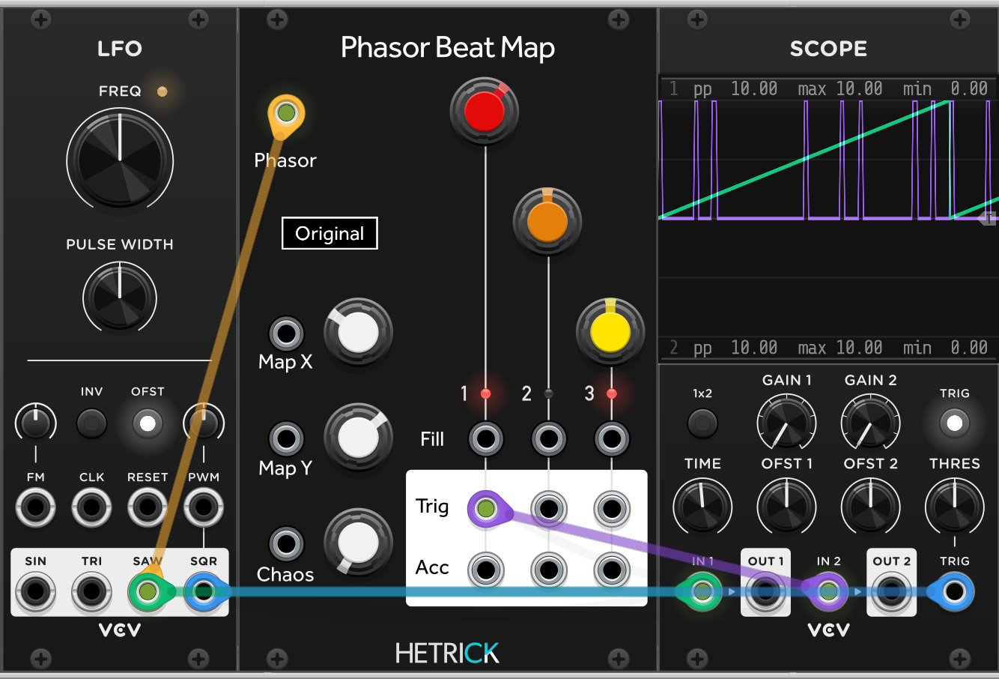

# Phasor Beat Map

Phasor-based version of Topograph by Valley Audio. This module is a port of Mutable Instruments' excellent Grids module. This module is separated from the HetrickCV repository due to the different licenses (Grids and Valley both use GPL, while HetrickCV is MIT).

## License

All code is licensed under GNU Public License v3.0
