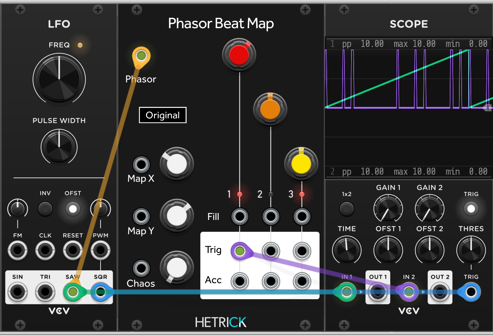

# HetrickCV GPL

## Phasor Beat Map

Phasor-based version of Topograph by Valley Audio. This module is a port of Mutable Instruments' excellent Grids module. 

## Phasor to Wavetable

Phasor-based version of VCV's Wavetable LFO and VCO.

## License

All code is licensed under GNU Public License v3.0

This set of modules is separated from the HetrickCV repository due to the different licenses. Grids, Valley, and VCV use GPL, while the original HetrickCV plugin is MIT.
